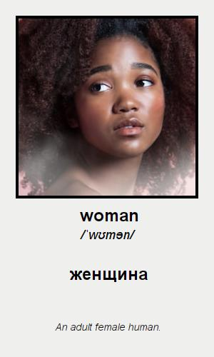
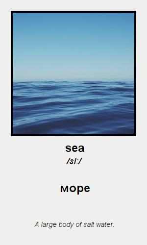

# WordComposerMicroservice

> [!CAUTION]
> Это тестовый проект для презентации. Его запуск не подразумевается из-за комплексности, хотя это и возможно при должном желании 😃
>
> Известные проблемы: кривая архитектура с постоянным сохранением статуса объекта и кучей лишних вызовов Utility-сервисов (S3/Database) могут сильно замедлять быстродействие и в некоторых случаях приводить к ошибкам. В идеале объект должен сохраняться только 1 раз, когда он будет полностью собран.

> [!NOTE]  
> [Demo video](examples/459325760231.mp4)
> [WCM Scheme](https://www.figma.com/board/NAss9AIxLZl4a5mzyvPmw3/WCM-Scheme?node-id=27-296&t=xo68IR39sDgCMfbt-4)

> [!NOTE]  
> Данное приложение помогает обрабатывать **англоязычные** слова, которые в последствии получают **перевод, транскрипцию, значение, а также изображение для создания карточки слова**.
>
> 
>
> 

> [!TIP]
> Требуется всё необходимое:
> * [GITHUB CLOUD CONFIG SETTINGS](https://github.com/hannahmontana-554/word-composer-microservices/tree/master/spring_cloud_config_settings-master)
> * API KEYS_SECRETS -> (https://dictionaryapi.dev/, https://unsplash.com/, https://imgbb.com/)
> * S3 Container
> * Self-hosted LibreTranslate in Docker
> * Postgresql DB
> * [Elastic-Stack for logging (Optional)](https://github.com/hannahmontana-554/elk-stack)
> * minikube -> strimzi config with 3 kafka topics: initial-topic, image-handler-topic, card-representor-topic
